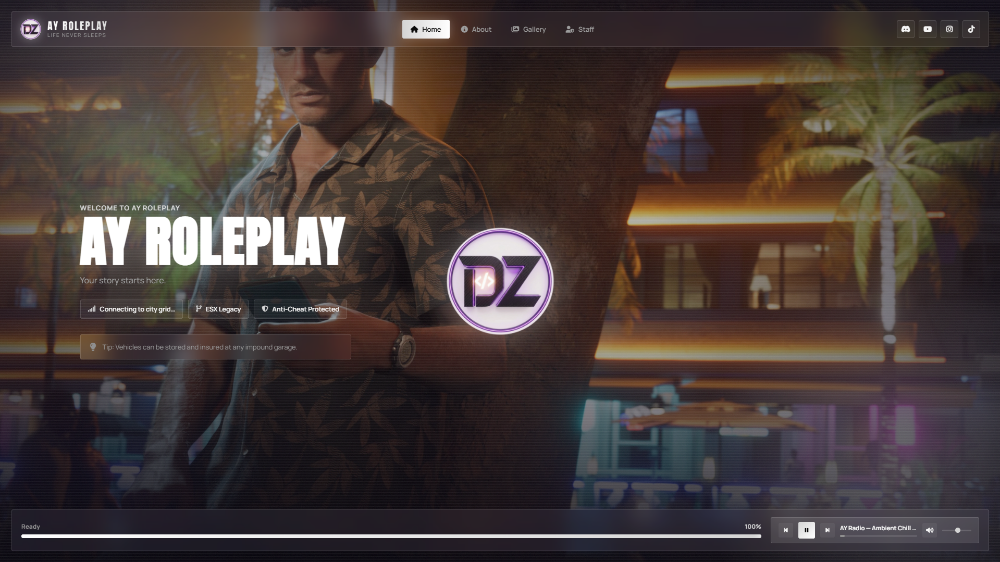
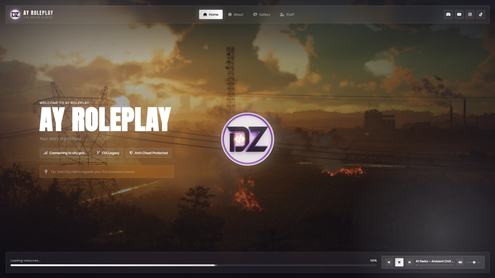

# 🎮 AY Roleplay — Loading Screen

<p align="center">
  <strong>A modern & fully customizable loading screen for FiveM / ESX Legacy servers.</strong>
</p>

<p align="center">
  
  
  
  
  
</p>

---

## ✨ Preview

<p align="center">
  
  
</p>

---

## 🚀 Features

- 🎨 **Modern Dark UI**
- ⚡ **Real-time FiveM Loading Progress**
- 🖼️ **Animated Background Slideshow**
- 🎵 **Built-in Music Player**
- ⏯️ **Play / Pause Controls**
- ⏮️ **Previous / Next Track**
- 🏠 **Home Section**
- ℹ️ **About Section**
- 🖼️ **Gallery Section**
- 👥 **Staff Section**
- 🔗 **Social Media Links**
- 💡 **Rotating Loading Tips**
- 📱 **Responsive Design**
- 🎯 **Easy to Customize**
- 🧩 **FiveM / ESX Legacy Ready**
- 🔥 **Lightweight & Performance Friendly**

---

## 📦 Installation

### 1️⃣ Download

Download or clone the repository and place the entire `ay_loadingscreen` folder inside your FiveM server's `resources` directory.

```text
resources/
└── ay_loadingscreen/
```

### 2️⃣ Add to `server.cfg`

Add the following line near the top of your `server.cfg`:

```cfg
ensure ay_loadingscreen
```

### 3️⃣ Restart Your Server

Restart your FiveM server and the loading screen will automatically appear when players connect.

---

## 📁 Project Structure

The project is split into two parts: `src/` (readable, editable source) and
`html/` (the obfuscated/minified **production build** — this is the only
part that actually needs to sit on your live server). See
[🔒 Security & Anti-Leak Build](#-security--anti-leak-build) below.

```text
ay_loadingscreen/
│
├── 📄 fxmanifest.lua
├── 📄 README.md
├── 📄 build.sh              ← regenerates html/ from src/
├── 📄 package.json
│
├── 📂 src/                  ← EDIT HERE — keep this folder private
│   ├── 📄 index.html
│   ├── 📂 css/  → 🎨 style.css
│   └── 📂 js/   → ⚙️ script.js
│
└── 📂 html/                 ← PRODUCTION BUILD — this is what ships/loads
    │
    ├── 📄 index.html         (minified, references the files below)
    ├── 📂 css/ → 🎨 style.min.css     (minified)
    ├── 📂 js/  → ⚙️ script.min.js     (minified + obfuscated)
    │
    ├── 📂 img/
    │   ├── 🖼️ char1.jpg
    │   ├── 🖼️ char2.jpg
    │   ├── 🖼️ char3.jpg
    │   └── 🖼️ char4.jpg
    │
    └── 📂 audio/
        └── 🎵 ambient-chill.mp3
```

---

## 🔒 Security & Anti-Leak Build

`html/js/script.min.js` and `html/css/style.min.css` are generated from the
readable sources in `src/` using `build.sh`, which:

- **Obfuscates the JavaScript** (`javascript-obfuscator`): renames variables
  and functions to meaningless hex identifiers, flattens control flow,
  injects dead code, encodes string literals, and adds self-defending /
  debug-protection code so the script re-mangles itself and resists being
  formatted or stepped through in a debugger.
- **Minifies the CSS and HTML** and strips all developer comments,
  TODOs, and internal notes from what actually ships.
- Removes the readable `script.js` / `style.css` from `html/` entirely —
  only the built, obfuscated versions are referenced by `fxmanifest.lua`.

**To make a change:** edit the files in `src/`, then run:

```bash
./build.sh
```

This regenerates everything under `html/`. Never hand-edit the `.min.js` /
`.min.css` files — your changes will be overwritten (and are unreadable
anyway).

**Be realistic about what this does and doesn't protect against.** This
raises the effort required to read, rebrand, or resell the script and stops
casual copy-pasting — it does **not** make leaking cryptographically
impossible, and no client-side obfuscation tool can promise that:

- Anyone who ends up with **FTP/file access to a server the resource is
  installed on** (a compromised host, a shared reseller panel, a malicious
  co-admin) can still copy the files straight off disk. Obfuscation changes
  what they'd see if they opened the file, not whether they can copy it.
- The most effective protection is controlling **who gets file access** in
  the first place — keep `src/` out of anything you hand to customers or
  push to a public repo, and use private/permissioned Git hosting.
- If you're selling this and want Cfx.re-backed protection, look into
  **FiveM's official asset escrow via Keymaster** — that encrypts the
  resource server-side so it's never distributed in plaintext at all,
  which is a stronger guarantee than any obfuscator running in this build.

---

## 🎨 Customization

### 🏷️ Server Name & Tagline

Open:

```text
html/index.html
```

Edit the following elements:

```text
brand-name
hero-title
hero-tagline
```

You can use them to customize your server name, slogan and description.

---

### 🔗 Social Links

Inside `index.html`, find:

```html
<div class="social-row">
```

Update the `href` values with your own social media links.

Example:

```html
<a href="https://discord.gg/yourserver">
```

---

### ℹ️ About Section

Customize the server description and features inside:

```html
#panel-about
```

You can add information such as:

- 🌐 Server information
- 🎮 Game modes
- 🏙️ Roleplay features
- ⭐ Server highlights
- 📢 Important announcements

---

### 👥 Staff Section

Staff members can be edited inside:

```html
#panel-staff
```

Each staff card can be customized with:

- 👤 Name
- 🛡️ Role
- 🎨 Icon
- 📝 Description

You can also duplicate or remove cards depending on your staff team.

---

### 🖼️ Gallery

Gallery images are located inside:

```text
html/img/
```

Replace the default images with your own screenshots or artwork.

Gallery captions can be changed inside each:

```html
<span>Gallery Caption</span>
```

---

## 🎵 Music Player

The loading screen includes a built-in music player.

Add your `.mp3` files to:

```text
html/audio/
```

Then add the files to the `files {}` section inside:

```text
fxmanifest.lua
```

Example:

```lua
files {
    'html/index.html',
    'html/css/style.css',
    'html/js/script.js',

    'html/audio/ambient-chill.mp3'
}
```

Additional tracks can be added to the playlist logic inside:

```text
html/js/script.js
```

The **Previous / Next** buttons are already prepared for playlist support.

---

## 📊 Loading Progress

The progress bar uses FiveM's real:

```lua
loadProgress
```

event.

This means the loading progress reflects the actual resource streaming progress while the player is connecting to the server.

### 🌐 Browser Preview

When opening `index.html` directly in a normal browser, FiveM's `loadProgress` event is unavailable.

In that case, a small demo animation is automatically used so you can preview the loading screen outside FiveM.

---

## 🎨 Styling & Theme

All visual styling is handled inside:

```text
html/css/style.css
```

Main theme variables are defined inside:

```css
:root {
    /* Theme variables */
}
```

This makes it easy to completely retheme the loading screen without editing the entire stylesheet.

---

## 🌐 External Resources

This project uses:

- 🔤 **Google Fonts**
- ⭐ **Font Awesome**

Both resources are loaded through their official CDNs.

FiveM's loading-screen browser has internet access, so they work directly in-game.

> 💡 If you want a completely offline loading screen, you can download and bundle the required font files locally.

---

## ⚙️ Requirements

- 🎮 FiveM Server
- 🧩 ESX Legacy or compatible framework
- 🌐 Modern FiveM Client

### 📌 Dependencies

**No additional dependencies are required.**

---

## 🛠️ Tech Stack

| Technology | Usage |
|------------|-------|
| 🌐 HTML5 | Page Structure |
| 🎨 CSS3 | UI & Animations |
| ⚙️ JavaScript | Interactions & Logic |
| 🎮 FiveM NUI | Loading Screen Integration |
| ⭐ Font Awesome | Icons |
| 🔤 Google Fonts | Typography |

---

## 📸 Screenshots

<p align="center">
  
</p>

<p align="center">
  
</p>

---

## 💡 Why AY Roleplay Loading Screen?

AY Roleplay Loading Screen was designed to give FiveM servers a more professional first impression while keeping the codebase simple and easy to customize.

Whether you're running a:

- 🏙️ Roleplay Server
- 🚓 Police / Emergency Server
- 🏎️ Racing Server
- 🎮 Freeroam Server
- 🌐 Custom FiveM Project

You can quickly adapt the loading screen to your own server.

---

## 🤝 Contributing

Feel free to fork the project and customize it for your own FiveM server.

Pull requests, improvements and suggestions are welcome! ❤️

---

## ⭐ Support the Project

If you found **AY Roleplay Loading Screen** useful:

⭐ Give the repository a star  
🍴 Fork the project  
📢 Share it with the FiveM community

---

<div align="center">

# 🎮 AY Roleplay

### Modern • Clean • Customizable

Made for the **FiveM Community** ❤️

</div>