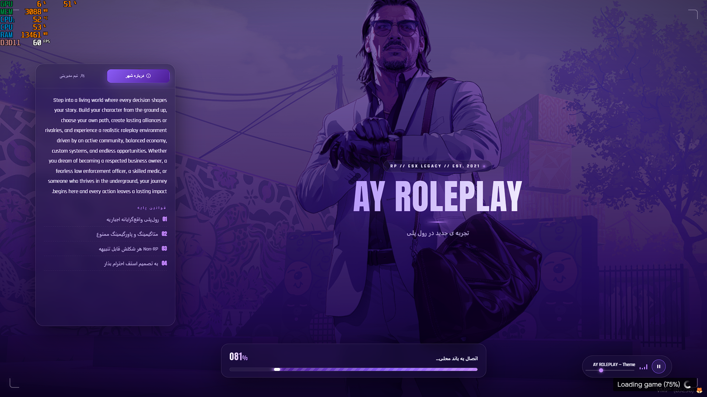

# 🟣 AY LoadingScreen

<p align="center">
  <strong>A cinematic, modern and fully customizable Loading Screen for FiveM.</strong>
</p>

<p align="center">
  Built with <strong>React + Vite</strong> and designed for immersive FiveM / ESX Legacy roleplay servers.
</p>

<p align="center">
  
  
  
  
</p>

<p align="center">
  <a href="https://github.com/AmiraliYavari/AY-LoadingScreen">
    
  </a>
  <a href="https://github.com/AmiraliYavari/AY-LoadingScreen/issues">
    
  </a>
  <a href="https://github.com/AmiraliYavari/AY-LoadingScreen">
    
  </a>
</p>

---

## ✦ Preview

<p align="center">
  
</p>

> A cinematic loading experience designed to make the first seconds of joining your server feel like part of the game.

---

## 🚀 About

**AY LoadingScreen** is a modern FiveM loading screen built from the ground up with **React 18 + Vite**.

Instead of a traditional HTML/CSS loading page, AY LoadingScreen uses a component-based architecture with real FiveM loading progress, glassmorphism UI, animated typography, music controls and configurable server information.

The goal is simple:

> **Turn the loading screen into part of the server experience.**

Designed for **FiveM**, **ESX Legacy**, and custom roleplay servers.

---

# ✨ Features

### 🎨 Cinematic UI

* Modern glassmorphism interface
* Purple / white visual identity
* Cinematic GTA-style background
* HUD-inspired layout
* Animated gradient typography
* Subtle Ken Burns background animation
* Minimal and clean visual effects

### 📊 Real FiveM Loading Progress

The loading bar isn't just a fake animation.

AY LoadingScreen listens to FiveM's real:

```js
loadProgress
```

event and displays the actual loading progress sent by the game.

```js
window.addEventListener('message', (event) => {
    if (event.data.eventName === 'loadProgress') {
        const progress = event.data.loadFraction;
    }
});
```

When running outside FiveM, a small fallback simulator is used so the browser preview doesn't look empty.

---

### 🎵 Built-in Music Player

A compact music player is included directly inside the loading interface.

Features:

* Play / Pause
* Volume control
* Animated equalizer
* Autoplay fallback
* Local `.mp3` support

Simply replace:

```text
public/music/theme.mp3
```

with your own track.

---

### 🗂️ Server Information

The loading screen includes a dedicated information panel with multiple sections.

You can display:

* Server description
* City information
* Rules
* Management team
* Staff information
* Loading messages

Everything is configurable without touching the main React components.

---

### ⚙️ Centralized Configuration

Most of the content is controlled from:

```text
src/data.js
```

For example:

```js
SERVER
ABOUT_TEXT
RULES
TEAM
LOADING_STATUSES
```

This means you can completely rebrand the loading screen without rebuilding the UI architecture.

---

### 📱 Responsive Design

AY LoadingScreen automatically adapts to different screen sizes.

On smaller screens:

* Panels stack vertically
* Content becomes scrollable
* UI spacing adjusts automatically
* Music controls remain accessible

---

### ♿ Reduced Motion Support

The interface respects:

```css
prefers-reduced-motion
```

Users who prefer reduced motion won't receive unnecessary animations.

---

# 🧩 Project Structure

```text
AY-LoadingScreen/
│
├── src/
│   ├── App.jsx
│   ├── LoadingBar.jsx
│   ├── MusicPlayer.jsx
│   ├── Team.jsx
│   ├── data.js
│   └── index.css
│
├── public/
│   ├── wallpaper.jpg
│   └── music/
│       └── theme.mp3
│
├── .github/
│   └── screenshots/
│
├── fxmanifest.lua
├── index.html
├── package.json
├── vite.config.js
├── bun.lock
└── README.md
```

---

# 🛠️ Tech Stack

| Technology     | Purpose                            |
| -------------- | ---------------------------------- |
| ⚛️ React 18    | UI architecture                    |
| ⚡ Vite 5       | Development & production build     |
| 🎮 FiveM NUI   | Loading screen runtime             |
| 🎨 CSS         | UI, animations & responsive design |
| 🎵 HTML5 Audio | Music player                       |
| 🧩 JavaScript  | Logic & configuration              |

No frontend CSS framework is required.

---

# 📦 Installation

## 1. Download

Clone the repository:

```bash
git clone https://github.com/AmiraliYavari/AY-LoadingScreen.git
```

Or download the repository as ZIP.

---

## 2. Install Dependencies

Using npm:

```bash
npm install
```

Or using Bun:

```bash
bun install
```

---

## 3. Build the Loading Screen

```bash
npm run build
```

or:

```bash
bun run build
```

This generates:

```text
dist/
```

The `dist` directory contains the production-ready NUI files.

---

# 🎮 FiveM Installation

Place the resource inside your server:

```text
resources/
└── [loadscreen]/
    └── ay-loadingscreen/
```

Then add this to your:

```text
server.cfg
```

```cfg
ensure ay-loadingscreen
```

The resource's `fxmanifest.lua` points FiveM to:

```text
dist/index.html
```

and FiveM will automatically use it as the server loading screen.

---

# ⚙️ Configuration

You can customize the majority of the loading screen from:

```text
src/data.js
```

### Server Information

```js
SERVER
```

Change:

* Server name
* Tagline
* Hero information
* Server identifiers

### About Section

```js
ABOUT_TEXT
```

### Rules

```js
RULES
```

### Management Team

```js
TEAM
```

### Loading Messages

```js
LOADING_STATUSES
```

---

# 🎨 Customization

## 🖼️ Background

Replace:

```text
public/wallpaper.jpg
```

with your own image.

---

## 🎵 Music

Replace:

```text
public/music/theme.mp3
```

with your own music.

If you change the filename, update the track source inside:

```text
MusicPlayer.jsx
```

---

## 🎨 Colors

Open:

```text
src/index.css
```

and edit the variables inside:

```css
:root {
    /* Color tokens */
}
```

The UI is designed around a purple / white cinematic palette, but it can easily be re-themed.

---

# 🧑‍💻 Development

Start the Vite development server:

```bash
npm run dev
```

or:

```bash
bun run dev
```

Then open the local development URL shown by Vite.

> ⚠️ The real FiveM `loadProgress` event is only available inside FiveM. The browser preview therefore uses a fallback progress simulator.

---

# 📈 How Loading Progress Works

Inside FiveM, the loading bar receives progress through:

```js
window.addEventListener('message', (event) => {
    if (event.data.eventName === 'loadProgress') {
        const progress = event.data.loadFraction;
    }
});
```

`loadFraction` is a value between:

```text
0 → 1
```

For example:

```text
0.00  → 0%
0.25  → 25%
0.50  → 50%
0.75  → 75%
1.00  → 100%
```

This allows the UI to display the actual loading state instead of pretending that the server is loading.

---

# 🧱 Architecture

AY LoadingScreen follows a simple component-based architecture:

```text
App
│
├── LoadingBar
│   └── FiveM loadProgress
│
├── MusicPlayer
│   └── HTML5 Audio
│
└── Team
    └── Management Data
```

Content is separated from UI through:

```text
src/data.js
```

while visual styling is centralized inside:

```text
src/index.css
```

This makes the project easier to maintain and customize.

---

# 💡 Why AY LoadingScreen?

Most loading screens are treated as a simple page shown while players wait.

AY LoadingScreen takes a different approach.

It's designed as a **first impression**.

From the moment a player connects, the interface communicates:

* Server identity
* Visual style
* Rules
* Staff
* Music
* Progress
* Overall server quality

### The loading screen is part of the experience.

---

# 🔮 Roadmap

Possible future improvements:

* [ ] Multiple music tracks
* [ ] Music playlist system
* [ ] Volume persistence
* [ ] Server player count
* [ ] Discord integration
* [ ] Dynamic server status
* [ ] Multiple visual themes
* [ ] Theme configuration system
* [ ] More loading animations
* [ ] Advanced configuration file
* [ ] Built-in screenshot gallery

---

# 🤝 Contributing

Contributions, suggestions and improvements are welcome.

If you find a bug or have an idea:

1. Open an Issue
2. Explain the problem or feature
3. Provide screenshots or logs when possible
4. Submit a Pull Request if you've implemented a fix

---

# ⭐ Support the Project

If AY LoadingScreen helped your server, consider giving the repository a ⭐ on GitHub.

It helps the project get discovered by more FiveM developers.

---

# 👨‍💻 Author

<p align="center">
  <strong>Amirali Yavari</strong>
</p>

<p align="center">
  FiveM Developer · Full-Stack Developer · React Developer
</p>

<p align="center">
  <a href="https://github.com/AmiraliYavari">
    GitHub
  </a>
  •
  <a href="https://amiraliyavari.top">
    Website
  </a>
</p>

---

<p align="center">
  <strong>AY LoadingScreen</strong>
  <br>
  Built for FiveM. Designed for immersion.
</p>

<p align="center">
  ⭐ If you like it, star the repository.
</p>
