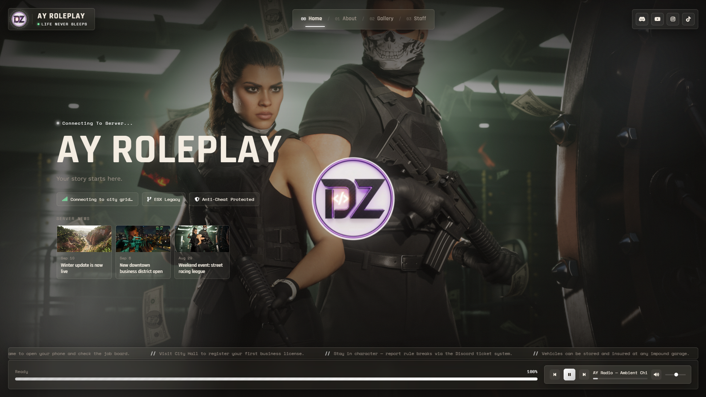
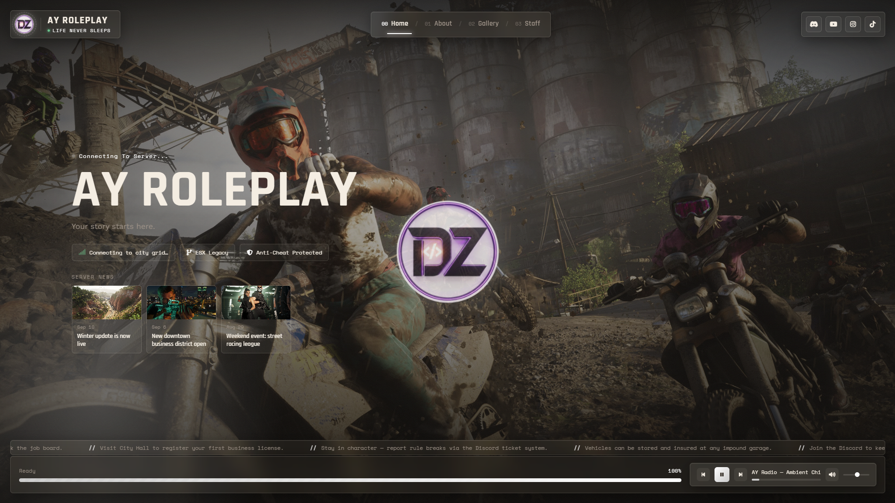
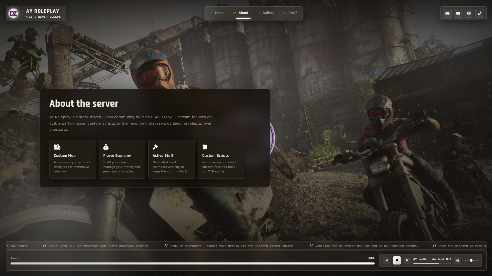
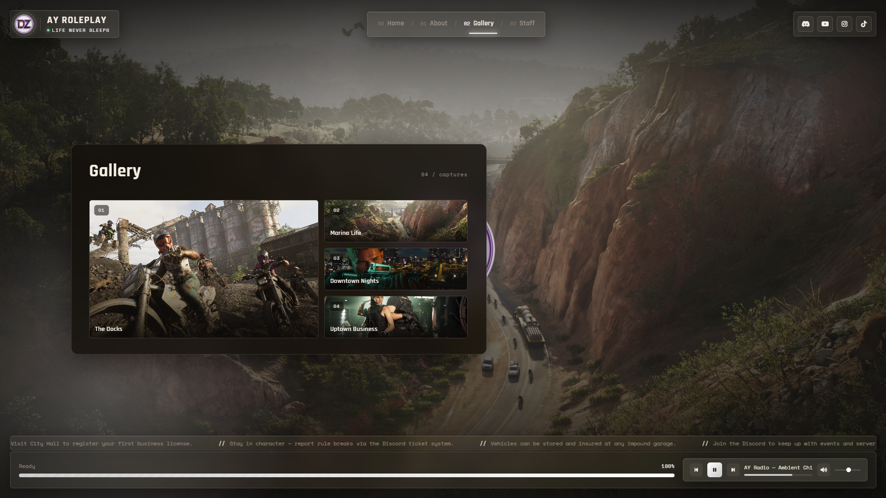
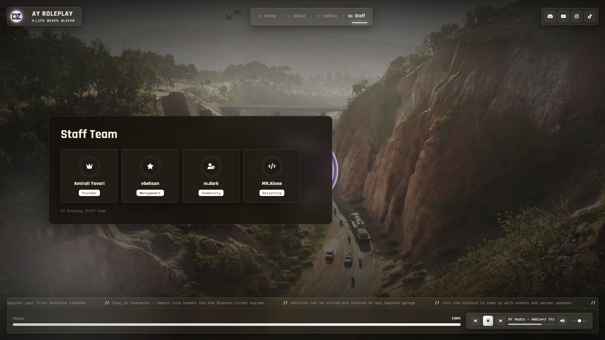

# ⚡ AY Loading Screen V2

<div align="center">



<br><br>

# AY Loading Screen

### A modern, customizable and immersive loading screen for FiveM servers.

<br>


</div>

---

## ✦ About

**AY Loading Screen V2** is a modern, lightweight and customizable loading
screen designed for FiveM servers.

Version 2 introduces a refreshed interface, smoother animations,
improved visuals and a more immersive loading experience.

Built to give players a clean and professional first impression
from the moment they connect to your server.

---

## ✦ Screenshots

<div align="center">



<br><br>



<br><br>



<br><br>



</div>

---

## ✦ Features

### Loading Experience

- Modern dark interface
- Custom server branding
- Smooth loading animations
- Loading progress
- Custom loading messages
- Responsive design

### Music Player

- Play / Pause controls
- Volume control
- Custom background music
- Integrated music player
- Clean and minimal interface

### Server Information

Display important server information directly
inside the loading screen.

```text
Server Name
Server Description
Server Rules
Server Information
Community Information
````

### Server Gallery

Showcase your server with custom screenshots,
images and other media.

### Social Media

Connect your players directly to your community.

```text
Discord
YouTube
Instagram
Telegram
Website
```

---

## ✦ Version 2

AY Loading Screen V2 brings a redesigned experience
focused on performance, visual quality and customization.

### What's New

* Completely redesigned UI
* Improved animations
* Better loading experience
* Improved music player
* Server gallery
* Server information section
* Social media integration
* Responsive layout
* Improved performance
* Easier customization

---

## ✦ Installation

### 1. Download

Download the latest version of **AY Loading Screen**
from this repository.

### 2. Add the Resource

Place the resource inside your FiveM resources directory.

```text
resources/
└── [scripts]/
    └── ay_loadingscreen/
```

### 3. Add to server.cfg

Add the following line to your `server.cfg`:

```cfg
ensure ay_loadingscreen
```

### 4. Restart Your Server

Restart your FiveM server.

The loading screen will automatically appear
when players connect.

---

## ✦ Folder Structure

```text
ay_loadingscreen/
│
├── assets/
│   ├── images/
│   ├── music/
│   └── icons/
│
├── html/
│   ├── index.html
│   ├── style.css
│   └── script.js
│
├── screenshot.png
├── screenshot1.png
├── screenshot2.png
├── screenshot3.png
├── screenshot4.png
│
├── client.lua
├── fxmanifest.lua
└── README.md
```

---

## ✦ Customization

AY Loading Screen V2 is designed to be easy to customize.

You can customize:

```text
Server Name
Server Logo
Background
Colors
Music
Images
Social Links
Server Information
Loading Text
Gallery
```

Simply edit the required files inside the resource
and restart your server.

---

## ✦ Requirements

```text
FiveM
FXServer
```

No additional dependencies are required.

---

## ✦ Performance

AY Loading Screen V2 is designed to remain lightweight
while providing a modern visual experience.

The resource focuses on:

* Smooth animations
* Low resource usage
* Optimized UI
* Responsive rendering
* Fast loading

---

## ✦ Credits

<div align="center">

# AY Loading Screen V2

### Direct By AmirVentus

Designed and developed for the FiveM community.

</div>

---

## ✦ Support

Found a bug or have a suggestion?

Open an issue on GitHub or contact the developer.

---

<div align="center">

# AY Loading Screen

### Version 2.0.0

**Made for FiveM**

**Direct By AmirVentus**

</div>
